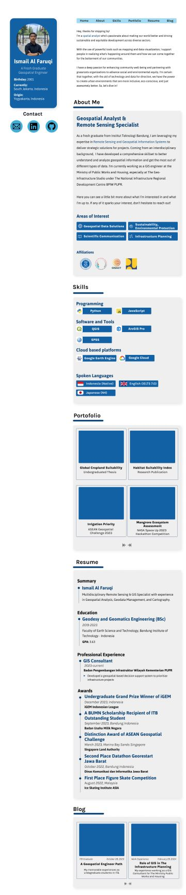

# Personal Website of Ismail Al Faruqi

Welcome to my personal corner on the internet where I share my profile, projects, thoughts, and experiences in related to geospatial technology.

## Links

- Website: [mailfaruqi.com](mailfaruqi.com)
- Figma: [figma.com/mailfaruqi](https://www.figma.com/file/Few50JS0Ll4uwjNBjvHP6w/Personal-Web?type=design&node-id=0%3A1&mode=design&t=Tm91akWrf6o4k3Sb-1)

## Projects

Here are some of the projects I've worked on:

### Project 1: ASRI (All Sectors Recommendation Infrastructure)

Geospatially-Driven Framework for Holistic PUPR Infrastructure Assessment, Monitoring, and Recommendations. [More about this project](project-link).

### Project 2: Habitat Suitability Index of Surili

An evaluation of the strategic ecosystem restoration potential. [More about this project](https://www.sciencedirect.com/science/article/abs/pii/S2352938523001490?via%3Dihub).

### Project 3: Irrigation Priority

Provide information that will help users assess land suitability for crop production and prioritise areas for irrigation. [More about this project](https://www.itb.ac.id/berita/tim-mahasiswa-itb-raih-medali-emas-asean-geospatial-challenge-2023/59326).

### Project 4: Meow (Mangrove Ecosystem Optimization Workgroup)

Development of an integrated information system for assessing mangrove ecosystems in Indonesia. [More about this project](https://www.spaceappschallenge.org/2023/find-a-team/meow/?tab=project).

## Blog

I occasionally write about my work, new technologies, and personal experiences in the geospatial tech industry. Here are a few of my latest posts:

- [A Geospatial Engineer Path](link-to-post)
- [Role of GIS in The Infrastructure Planning](link-to-post)

## Contact

- Email: [mailfaruqi@icloud.com](mailto:mailfaruqi@icloud.com)
- LinkedIn: [linkedin.com/mailfaruqi](https://www.linkedin.com/in/mailfaruqi)
- GitHub: [github.com/mailfaruqee](https://github.com/mailfaruqee)

## Preview

### Home

